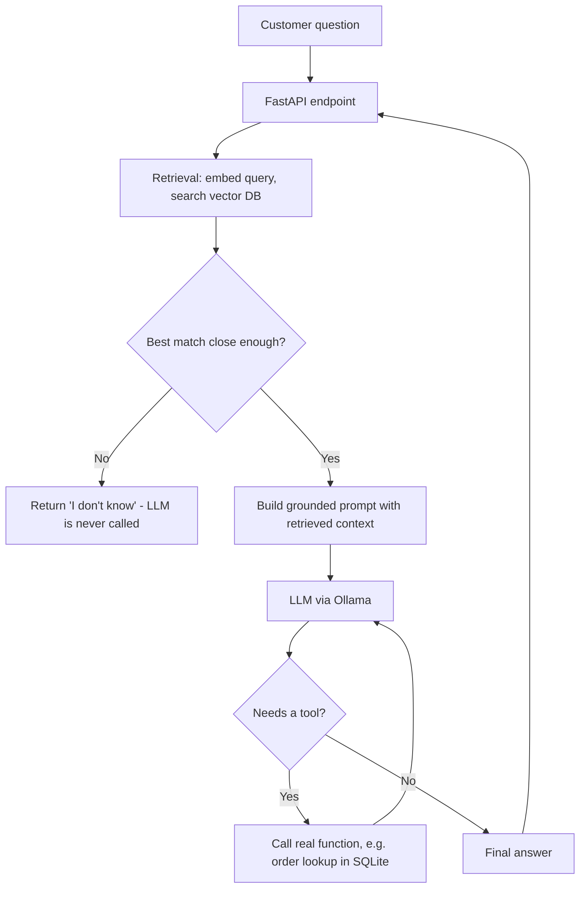

# Customer Support Copilot

Hello, welcome to my AI-powered customer support assistant for e-commerce. 
I built it as a hands-on learning project to demonstrate practical AI engineering
skills: Retrieval-Augmented Generation (RAG), agentic tool-calling,
containerization, and a cost-conscious architecture that runs entirely
on local, open-source models.

## The problem this solves

Customer support teams at e-commerce companies handle a high volume of
repetitive questions: "What's the battery life of this product?",
"Can I return this item?", "What's the status of my order?". Most of
these questions have a clear, factual answer that already exists
somewhere — a product spec sheet, an FAQ, an order database — but
finding it manually takes time.

This project demonstrates how an LLM-based assistant can answer these
questions **accurately and safely**, grounded in company data
rather than the model's general knowledge, and can take real actions
(like looking up an order) instead of just generating text.

## What it does

- **Answers product and policy questions** by retrieving relevant
  information from a product catalog and FAQ knowledge base (RAG),
  rather than relying on the model's possibly outdated or incorrect
  general knowledge.
- **Looks up real order status** through an agentic tool-calling
  layer: the model decides when it needs live data and calls a real
  function to fetch it, instead of guessing.
- **Refuses to answer when it doesn't know**, using a combination of
  a similarity-distance threshold, strict prompt instructions, and
  low sampling temperature — a layered defense against hallucination
  rather than relying on a single safeguard.
- **Runs entirely locally and for free**, using open-source LLMs via
  Ollama, so it can be developed and demoed without any paid API
  keys.

## Architecture



## Tech stack and why

| Layer | Choice | Why |
|---|---|---|
| LLM | Ollama (Qwen2.5) | Free, runs locally on Apple Silicon, no API key or usage cost needed for development |
| Embeddings | sentence-transformers (multilingual MiniLM) | Free, runs on CPU, supports Czech and English |
| Vector database | ChromaDB | Zero-config, embedded, no server or account needed |
| Orders database | SQLite | Simple, file-based, sufficient to demonstrate real tool-calling against structured data |
| Backend | FastAPI | Fast to build, automatic request validation, built-in interactive API docs |
| Containerization | Docker / docker-compose | Reproducible environment, a step toward real-world deployment |

The architecture is deliberately provider-agnostic: the LLM client is
a thin, swappable layer, so the same codebase could point to a hosted
model (e.g. Gemini or OpenAI) by changing configuration rather than
rewriting logic — a reasonable next step for a production deployment
that needs to scale beyond local hardware.

## Key design decisions

**Layered defense against hallucination.** Grounding a model in
retrieved context does not, by itself, guarantee the model won't
speculate beyond it — smaller open-source models in particular will
sometimes add unsupported claims even when explicitly instructed not
to. This project addresses that with three independent layers: a
similarity-distance cutoff at the retrieval stage (so unrelated
questions never reach the LLM at all), a strict system prompt, and a
low temperature setting. No single layer is perfect, but together
they substantially reduce the risk of an incorrect answer reaching
the customer.

**Tools are looked up by name, not invoked directly by the model.**
The model can only request a tool call by name and arguments; the
actual function execution happens in application code. This keeps a
clear boundary between "what the model decides" and "what the system
is allowed to do."

**Absolute file paths instead of relative ones.** Data paths (for the
vector database and SQLite file) are resolved relative to the source
file's location, not the current working directory. This avoids a
class of bugs where the same code silently points to different data
depending on where it's launched from (a local script vs. a
containerized server) — a real issue encountered during development
of this project.

## Project structure

```
customer-support-copilot/
├── data/
│   └── catalog.py           # Fake product catalog & FAQ data
├── src/
│   ├── agent.py             # Tool-calling agent loop
│   ├── index_data.py        # Embeds and indexes documents into ChromaDB
│   ├── main.py              # FastAPI application
│   ├── order_db.py          # Sets up the fake SQLite orders database
│   ├── rag_query.py         # RAG pipeline: retrieval + grounded generation
│   └── tools.py             # Tool definitions for the agent
├── Dockerfile
├── docker-compose.yml
├── Readme.md
└── requirements.txt
```

## Running it locally

**Prerequisites:** [Ollama](https://ollama.com) installed and running,
with a model pulled (`ollama pull qwen2.5:14b`); Docker Desktop
installed.

```bash
# 1. Set up the vector database with product/FAQ data
python src/index_data.py

# 2. Set up the fake orders database
python src/order_db.py

# 3. Build and run the app in Docker
docker compose up --build
```

Once running, open `http://localhost:8000/docs` for interactive API
documentation, or send a request directly:

```bash
curl -X POST http://localhost:8000/ask \
  -H "Content-Type: application/json" \
  -d '{"question": "How long does the SoundMax battery last?"}'
```

## Limitations and possible next steps

This is a learning/portfolio project, not a production system. Known
simplifications and natural next steps:

- **Data is synthetic.** The product catalog and orders are fake,
  hand-written data rather than a real production feed.
- **Single-turn conversation.** The agent doesn't yet maintain memory
  across multiple messages in a conversation.
- **No automated tests or CI/CD pipeline yet.** Adding a test suite
  and a GitHub Actions pipeline would be the next step toward a more
  production-realistic setup.
- **No cloud deployment yet.** The natural next step is deploying the
  container to a serverless platform (e.g. GCP Cloud Run) and
  swapping the local LLM for a hosted one for better scalability.
- **The hallucination-prevention distance threshold was tuned by
  observation on a handful of examples**, not a systematic evaluation
  set. A production version would need a proper evaluation dataset
  and metrics (e.g. faithfulness, answer relevance).